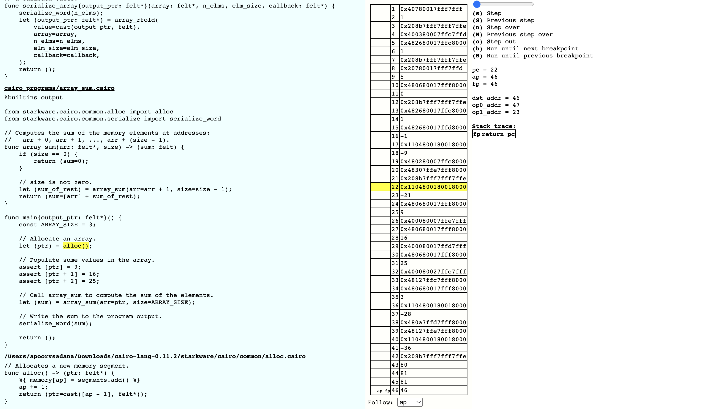

# Cairo Tracer

Cairo-vm offers a tracer which gives you a visualization of how your memory and registers change line after line as the VM executes the code.

## Setting up the tracer

To use the tracer, you need to build your the VM using the `with_tracer` feature flag.

```bash
cargo build --release --features with_tracer
```

## Running the tracer

Once the build in the above step is complete, you can use the `cairo-vm-cli` as you do normally with an additional argument `--tracer true`. This tells the VM to start a server where you can visualize the exection of your cairo program.

```bash
target/release/cairo-vm-cli <path_to_compiled_cairo_json> --layout <layout> --memory_file <path_to_store_memory_binary> --trace_file <path_to_store_tracer_binary> --tracer true
```

### NOTE
> The `--memory_file` and `--trace_file` arguments are compulsory at the moment as the current code relocates the memory and trace only when these arguments are supplied. However, edits can be made in future versions to relocate if only the `--tracer` option is specified.


## Using the tracer



You can go to [http://127.0.0.1:8100/static/index.html](http://127.0.0.1:8100/static/index.html) to see the tracer.

Use the following commands to visualize the code execution

- `s` to go to the next step
- `Shift + s` to go to the previous step
- `n` to step over
- `N` to previous step over
- `o` to step out
- `b` to run until you reach the next breakpoint
- `B` to run until you reach the previous breakpoint
